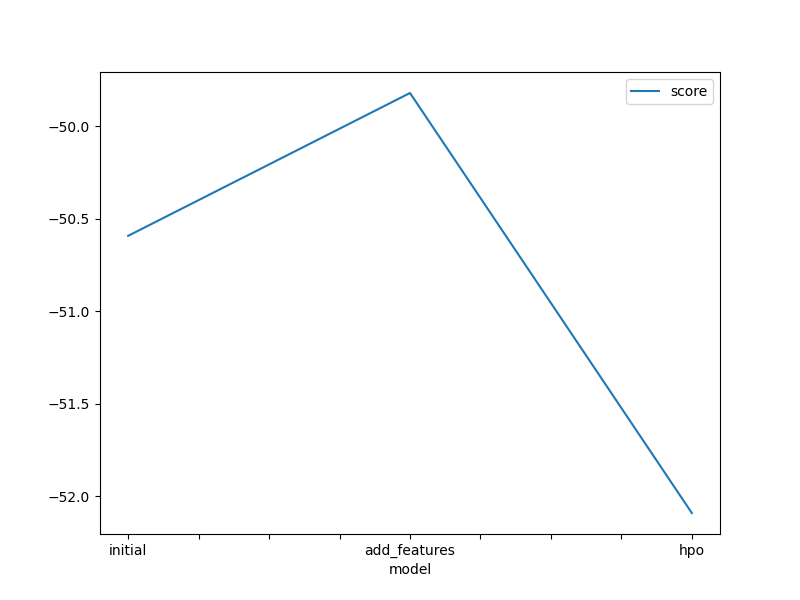
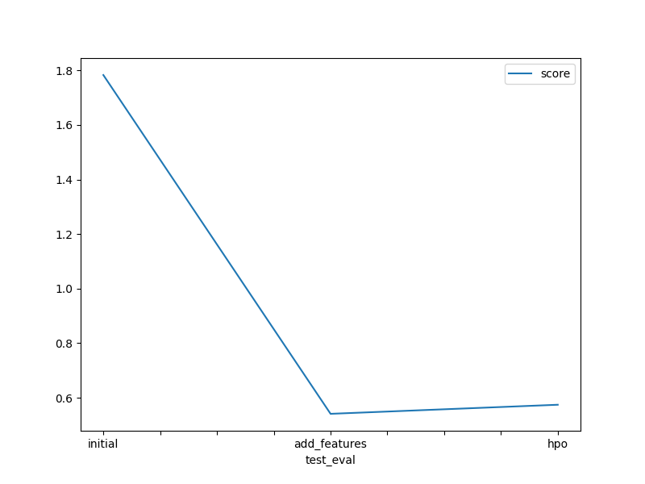

# Report: Predict Bike Sharing Demand with AutoGluon Solution
#### Gayoung Koo

## Initial Training
### What did you realize when you tried to submit your predictions? What changes were needed to the output of the predictor to submit your results?
* Before submitting my results, I had to understand which model from 'predictor.fit_summary()' is the best model in the train data and use the best model to fit the test data by 'predictor.predict(test)'. In addition to modeling and fitting, I had to change the values to 0 if the fitted values are smaller than 0, which cannot happen (i.e., No one can borrow the negative number of bikes.)  

### What was the top ranked model that performed?
* The weighted ensemble model performed best.

## Exploratory data analysis and feature creation
### What did the exploratory analysis find and how did you add additional features?
* I separated datetime data into month, day, and time, and with the additional features, I could find a better-performing model.  

### How much better did your model preform after adding additional features and why do you think that is?
* The score value of the weighted ensemble model increased by 0.771706, from -50.591929 to -49.820223 in the train data. The reason for the difference in performance is because the additional features of month, day, and time are meaningful to predicting bike sharing demands. Addtionally, it is understandable that people have some patterns of riding bikes based on month, day, and time.

## Hyper parameter tuning
### How much better did your model preform after trying different hyper parameters?
* After trying different hyper parameters, the model performance increased by 0.03328, from 0.54113 to 0.57441.

### If you were given more time with this dataset, where do you think you would spend more time?
* I would focus on hyper parameter optimization if I were given more time. For example, I can try different values for num_trials, or I can try different hyperparameters for each model type.

### Create a table with the models you ran, the hyperparameters modified, and the kaggle score.
|model|hpo1|hpo2|hpo3|score|
|--|--|--|--|--|
|initial|time_limit=600|auto_stack=False||1.78322|
|add_features|time_limit=600|auto_stack=True||0.54113|
|hpo|time_limit=1200|auto_stack=True|hyperparameters=hyperparameters, hyperparameter_tune_kwargs=hyperparameter_tune_kwargs|0.57441|

### Create a line plot showing the top model score for the three (or more) training runs during the project.

TODO: Replace the image below with your own.

### Create a line plot showing the top kaggle score for the three (or more) prediction submissions during the project.

TODO: Replace the image below with your own.

## Summary
* By predicting the bike sharing demands, I could try different ways in using 'TabularPredictor'. Especially I could directly compare the results of different ways by submitting the fitted results of test data to Kaggle.
